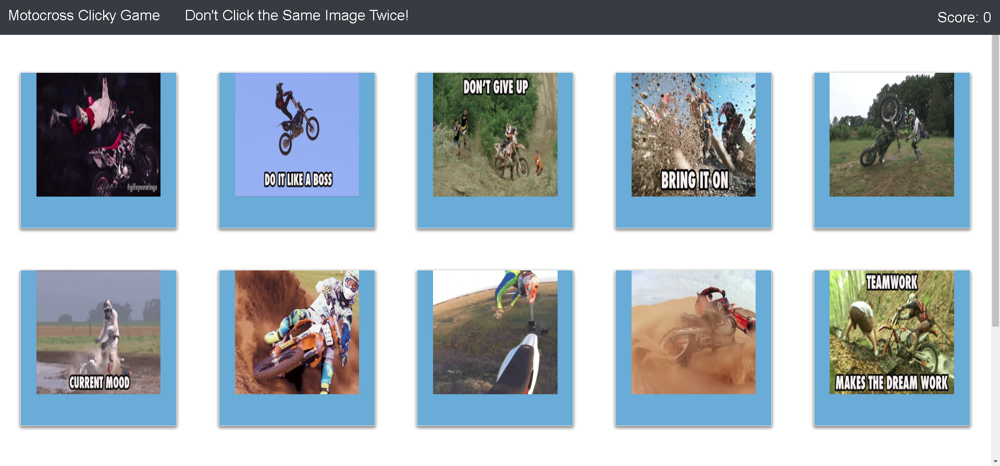

# ClickyGame

This app is a memory game built using React.js. The goal of the game is to click on each image only one time until of of the cards have been clicked. The game has 15 image cards that randomly shuffle on every click.  This makes the game a challenge!

## Screenshot

## How It Works
* The game starts by clicking on an image.
* After each click, the game randomly shuffles the cards using the Fisher–Yates algorithm and checks if the user has selected the card before.
* If the card has previously been selected, the game ends.
* If the card has not previously been selected, the player's score will increase.
* If the user reaches 15, the player wins and the game ends.

## Try It
https://billysterling.github.io/ClickyGame/
